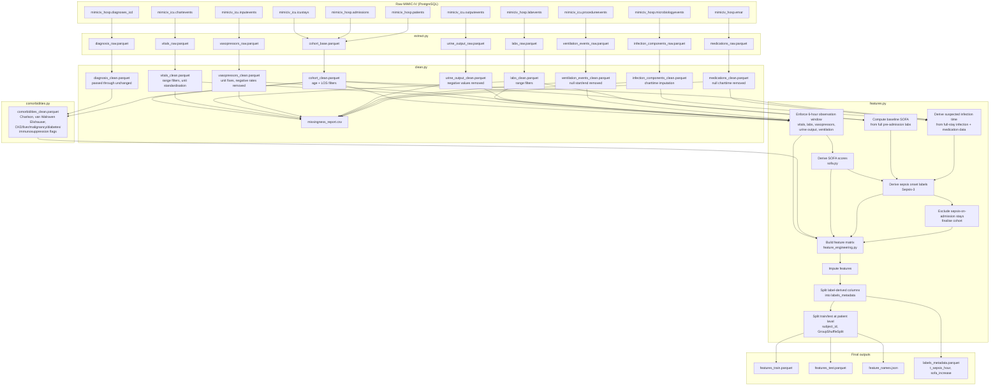

# Pipeline Flow

```mermaid
flowchart TD
    subgraph raw["Raw MIMIC-IV (PostgreSQL)"]
        A1[mimiciv_icu.icustays]
        A2[mimiciv_hosp.admissions]
        A3[mimiciv_hosp.patients]
        A4[mimiciv_hosp.labevents]
        A5[mimiciv_icu.chartevents]
        A6[mimiciv_hosp.diagnoses_icd]
        A7[mimiciv_icu.inputevents]
        A8[mimiciv_icu.outputevents]
        A9[mimiciv_icu.procedureevents]
        A10[mimiciv_hosp.microbiologyevents]
        A11[mimiciv_hosp.emar]
    end

    subgraph extract["extract.py"]
        B1[cohort_base.parquet]
        B2[vitals_raw.parquet]
        B3[labs_raw.parquet]
        B4[infection_components_raw.parquet]
        B5[medications_raw.parquet]
        B6[vasopressors_raw.parquet]
        B7[urine_output_raw.parquet]
        B8[ventilation_events_raw.parquet]
        B9[diagnosis_raw.parquet]
    end

    subgraph clean["clean.py"]
        C1[cohort_clean.parquet<br/>age + LOS filters]
        C2[vitals_clean.parquet<br/>range filters, unit standardisation]
        C3[labs_clean.parquet<br/>range filters]
        C4[infection_components_clean.parquet<br/>charttime imputation]
        C5[medications_clean.parquet<br/>null charttime removed]
        C6[vasopressors_clean.parquet<br/>unit fixes, negative rates removed]
        C7[urine_output_clean.parquet<br/>negative values removed]
        C8[ventilation_events_clean.parquet<br/>null start/end removed]
        C9[diagnosis_clean.parquet<br/>passed through unchanged]
        C10[missingness_report.csv]
    end

    subgraph comorbid["comorbidities.py"]
        CM1[comorbidities_clean.parquet<br/>Charlson, van Walraven Elixhauser,<br/>CKD/liver/malignancy/diabetes/<br/>immunosuppression flags]
    end

    subgraph features["features.py"]
        D1[Enforce 6-hour observation window<br/>vitals, labs, vasopressors,<br/>urine output, ventilation]
        D2[Derive SOFA scores<br/>sofa.py]
        D3[Compute baseline SOFA<br/>from full pre-admission labs]
        D4[Derive suspected infection time<br/>from full-stay infection + medication data]
        D5[Derive sepsis onset labels<br/>Sepsis-3]
        D6[Exclude sepsis-on-admission stays<br/>finalise cohort]
        D7[Build feature matrix<br/>feature_engineering.py]
        D8[Impute features]
        D9[Split label-derived columns<br/>into labels_metadata]
        D10[Split train/test at patient level<br/>subject_id, GroupShuffleSplit]
    end

    subgraph outputs["Final outputs"]
        E1[features_train.parquet]
        E2[features_test.parquet]
        E3[feature_names.json]
        E4[labels_metadata.parquet<br/>t_sepsis_hour, sofa_increase]
    end

    A1 --> B1
    A2 --> B1
    A3 --> B1
    A4 --> B3
    A5 --> B2
    A6 --> B9
    A7 --> B6
    A8 --> B7
    A9 --> B8
    A10 --> B4
    A11 --> B5

    B1 --> C1
    B2 --> C2
    B3 --> C3
    B4 --> C4
    B5 --> C5
    B6 --> C6
    B7 --> C7
    B8 --> C8
    B9 --> C9
    C1 --> C10
    C2 --> C10
    C3 --> C10
    C6 --> C10
    C7 --> C10
    C8 --> C10
    C4 --> C10
    C5 --> C10

    C9 --> CM1
    C1 --> CM1

    C1 --> D1
    C2 --> D1
    C3 --> D1
    C6 --> D1
    C7 --> D1
    C8 --> D1
    D1 --> D2
    C3 --> D3
    C1 --> D3
    C4 --> D4
    C5 --> D4
    C1 --> D4
    D2 --> D5
    D3 --> D5
    D4 --> D5
    D5 --> D6
    D1 --> D7
    CM1 --> D7
    D2 --> D7
    D5 --> D7
    D6 --> D7
    D7 --> D8
    D8 --> D9
    D9 --> D10

    D10 --> E1
    D10 --> E2
    D10 --> E3
    D9 --> E4
```